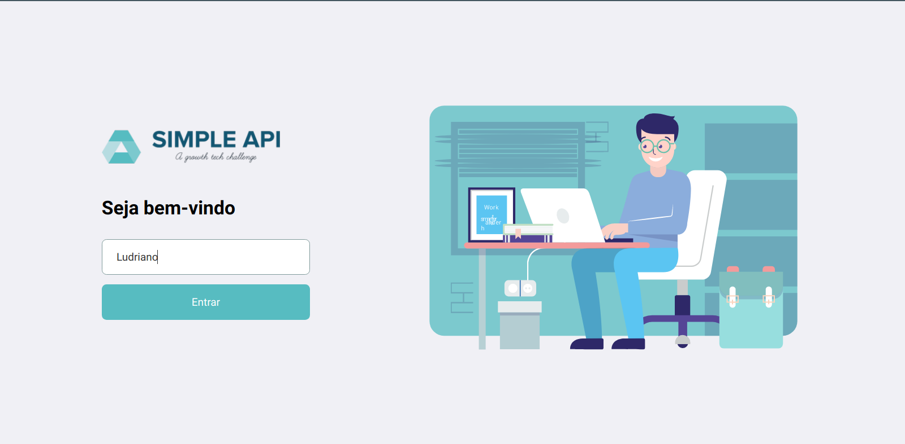

<h3 align="center">
  <br>
  <b>Visualise. Confira. Compare.</b>
</h3>
<p align="center">
  <br>
  <span>Tela de Entrada</span>
</p>

<br><br>

<p align="center">
  <a aria-label="Versão do Node" href="https://github.com/nodejs/node/blob/master/doc/changelogs/CHANGELOG_V12.md#12.14.1">
    </img>
  </a>
  <a aria-label="Versão do React" href="https://github.com/facebook/react/blob/master/CHANGELOG.md#16120-november-14-2019">
    </img>
  </a>
  
  <a aria-label="Desafios" href="DESAFIOS.md">
  	</img>
  </a>
  <a aria-label="Languages">
    
  </a>
  <a aria-label="Top Language">
    
  </a>
  <a aria-label="Repository size">
    
  </a>
  <a aria-label="License" href="LICENSE.md">
  	
  </a>

</p>

## Projeto
Este projeto consiste em criar uma API Express que consulta dois arquivos JSON fazendo a impressao em ReactJS.

### Desafio
Uma empresa deseja realizar um monitoramento de outros grupos empresariais em um site X para analisar seus posts. Sua tarefa é criar uma simples API que captura apenas os usuários (http://jsonplaceholder.typicode.com/users) os quais a empresa em que trabalham fazem parte de um grupo e exiba seus posts (http://jsonplaceholder.typicode.com/posts) unido do nome do funcionário e sua empresa. Além disso criar uma tela para facilitar a leitura desses posts.

- O backend obrigatoriamente precisa ser realizado com Express.js.
- O frontend obrigatoriamente precisa ser realizado com React.js.
- Apesar de bem simples, o projeto precisa estar pronto para produção.
- Sinta-se à vontade para adicionar mais features e criar uma UI maneira!

## Getting started

### Instalação - Backend
Para iniciar o **Backend** utilize os comandos:
```bash
cd backend
yarn install
yarn dev
```
Assim que o processo for iniciado no terminar, aparecerá uma mensagem informando em que porta o servidor estará rodando. Ex.: `Server running in: https://localhost:(porta)` 

### Instalação - Web
Para iniciar o **Web** utilize os comandos:
```bash
cd frontend
yarn install
yarn start
```
Assim que o processo terminar, automaticamente será aberta no seu navegador a página `localhost:3000`.  


## Como contribuir

- Fork esse repositório;
- Crie uma branch com a sua feature: `git checkout -b my-feature`
- Commit suas mudanças: `git commit -m 'feat: My new feature'`
- Push a sua branch: `git push origin my-feature`

---
## Licença

Esse projeto está sob a licença MIT. Veja o arquivo [LICENSE](LICENSE.md) para mais detalhes.

---
Feito com ❤️ by Ludriano Washington :wave: